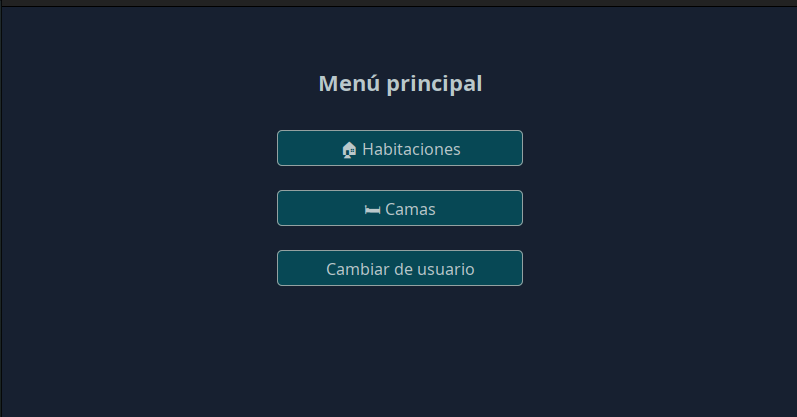
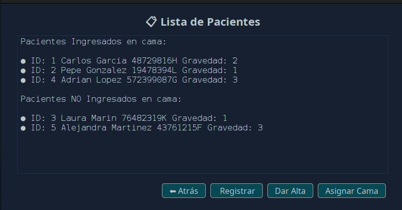
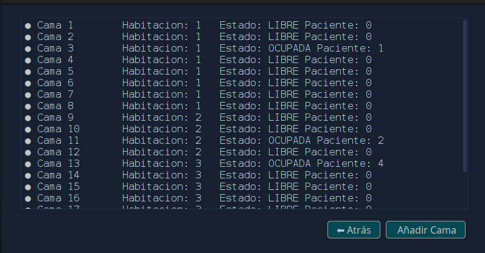
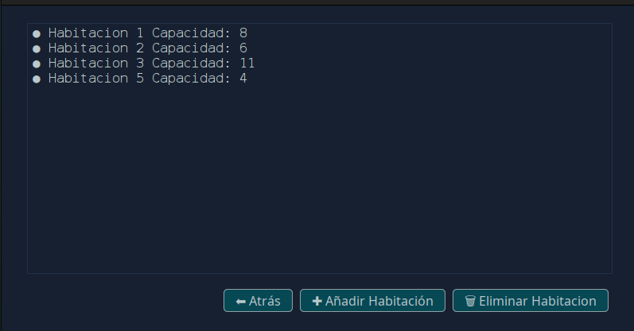

# 🏥 HospitalFlow

**HospitalFlow** es una aplicación diseñada para facilitar la gestión de camas hospitalarias. Permite a los administradores de hospitales controlar de forma eficiente la disponibilidad de habitaciones, camas y pacientes.

## 🚀 Funcionalidades principales

- 📁 **Gestión de habitaciones**
  - Agregar nuevas habitaciones
  - Eliminar habitaciones vacías

- 🛏️ **Gestión de camas**
  - Añadir camas a una habitación
  - Marcar camas como ocupadas o disponibles

- 🧍‍♂️ **Gestión de pacientes**
  - Registrar un nuevo paciente
  - Asignar un paciente a una cama disponible
  - Dar de alta a un paciente (liberando la cama)

## 🧩 Tecnologías utilizadas

- **Java** – Lógica del backend
- **Java Swing** – Interfaz gráfica de usuario
- **MySQL** – Base de datos relacional

## 🖥️ Capturas de pantalla







## ⚙️ Instalación y ejecución

Sigue estos pasos para instalar y ejecutar la aplicación **HospitalFlow** en tu entorno local:

### 1. Clona el repositorio

```bash
git clone https://github.com/gabri3234/HospitalFlow.git
```
### 2. Importa la base de datos

  - Abre tu gestor de bases de datos MySQL (por ejemplo, MySQL Workbench, phpMyAdmin o DBeaver).

  - Crea una nueva base de datos llamada hospitalflow.

  - Importa el archivo SQL ubicado en la carpeta DDBB/hospital.sql.


### 3. Configura la conexión a la base de datos

Edita el archivo `config.properties` que se encuentra en el directorio config del proyecto. Asegúrate de ingresar correctamente los datos de conexión a tu base de datos MySQL:

📄 **Ejemplo de archivo `config.properties`:**

```properties
# Dirección de la base de datos (puerto por defecto: 3306)
db.url=jdbc:mysql://localhost:3306/hospital

# Usuario de MySQL
db.user=tu_usuario

# Contraseña de MySQL
db.password=tu_contraseña
```

  ✅ Asegúrate de que el usuario tenga permisos para leer y escribir en la base de datos

  💡 Asegúrate de que el usuario tenga permisos de lectura y escritura sobre la base de datos.

### 4. Ejecuta la aplicación
Opción A: Desde tu IDE (Eclipse, IntelliJ, NetBeans)

Opción B: Desde consola

```bash
java -jar HospitalFlow.jar
```

  📝 Asegúrate de tener Java (JDK 8 o superior) y MySQL instalados y configurados correctamente en tu sistema.


## Requerimientos

[MySQL 8.0.27](https://downloads.mysql.com/archives/get/p/25/file/mysql-installer-web-community-8.0.27.1.msi)
